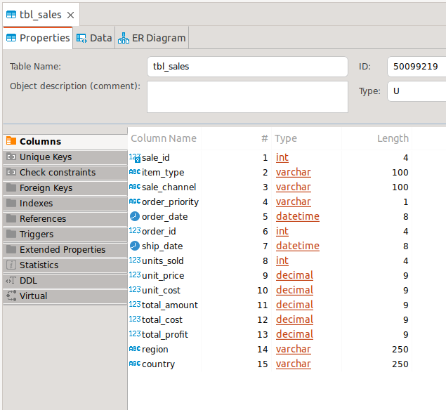

SPRING BOOT WITH AZURE SQL
---------------------------------------------------------------------------

**Spring Boot REST API that connects to Azure SQL Server.**

---------------------------------------------------------------------------

**Gradle dependencies used to work with Azure SQL and JPA:**

```
  runtimeOnly 'com.microsoft.sqlserver:mssql-jdbc'
  implementation 'org.springframework.boot:spring-boot-starter-data-jpa'
```

---------------------------------------------------------------------------

**A serverless SQL database was created in Azure:**


---------------------------------------------------------------------------

**Table tbl_sales was created in the database:**



---------------------------------------------------------------------------